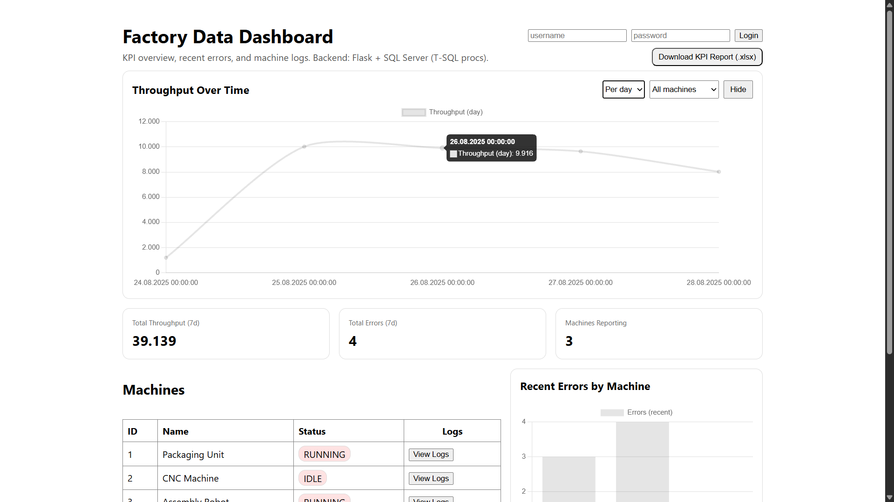
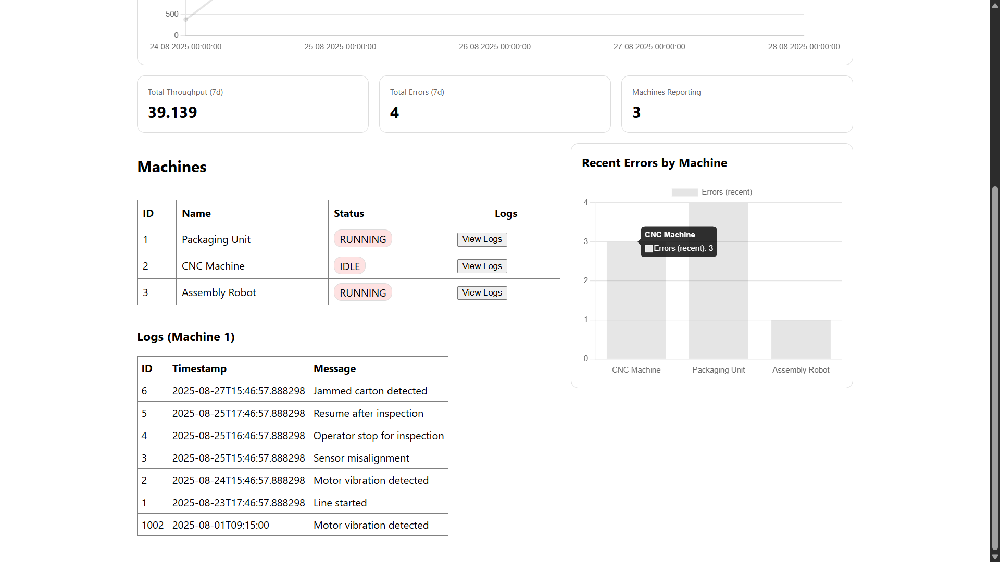
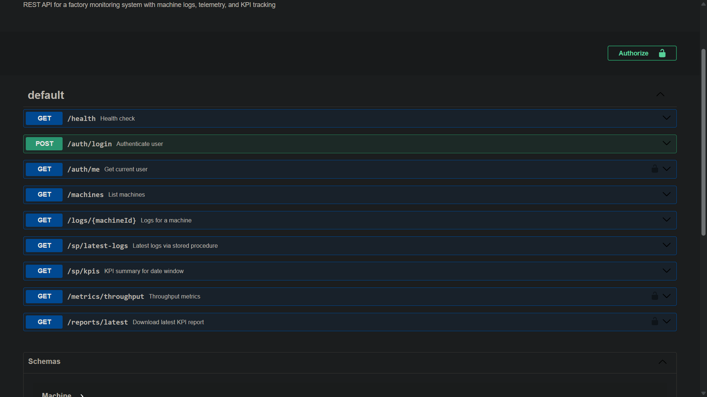

# Factory Data Dashboard

A full-stack dashboard for factory monitoring with a Flask API, SQL Server (T-SQL), and a React + Vite frontend. Includes JWT auth, Swagger docs, stored procedures, an ETL pipeline, and Excel report generation.

- API: [backend/app.py](backend/app.py), OpenAPI at [backend/openapi.json](backend/openapi.json)
- Frontend: [frontend/src/App.jsx](frontend/src/App.jsx)
- Database: schema and procs in [db/](db)
- ETL: [etl/ingest_logs.py](etl/ingest_logs.py)
- Report generation: [`backend.reports.generate_kpi_report`](backend/reports.py)

## Features

- REST API with Swagger UI at /docs
- JWT authentication (Admin-only report download)
- SQL Server schema, UDFs, and stored procedures
- React dashboard with charts (Chart.js)
- ETL to ingest CSV/JSON data with idempotent state
- Excel KPI report (.xlsx) generation

## Architecture

- Backend: Flask + SQLAlchemy + pyodbc
  - Auth: [`backend.auth.make_token`](backend/auth.py), [`backend.auth.require_auth`](backend/auth.py)
  - Routes: [`backend.app.login`](backend/app.py), [`backend.app.get_machines`](backend/app.py), [`backend.app.latest_logs`](backend/app.py), [`backend.app.kpi_summary`](backend/app.py), [`backend.app.throughput_metric`](backend/app.py), [`backend.app.download_latest_report`](backend/app.py)
  - Logging: [`backend.logging_config.init_json_logging`](backend/logging_config.py)
  - DB engine: [`backend.db.engine`](backend/db.py)
- Frontend: React + Vite
  - Components: [MachinesTable](frontend/src/components/MachinesTable.jsx), [ThroughputLineChart](frontend/src/components/ThroughputLineChart.jsx), [ErrorsBarChart](frontend/src/components/ErrorsBarChart.jsx), [KpiCards](frontend/src/components/KpiCards.jsx)
  - API client: [frontend/src/lib/api.js](frontend/src/lib/api.js), auth storage: [frontend/src/lib/auth.js](frontend/src/lib/auth.js)
- Database (SQL Server)
  - Create DB: [db/01_create_database.sql](db/01_create_database.sql)
  - Schema: [db/02_schema.sql](db/02_schema.sql)
  - Seed data: [db/03_seed.sql](db/03_seed.sql)
  - UDFs: [db/04_udfs.sql](db/04_udfs.sql)
  - Stored Procs: [db/05_procs.sql](db/05_procs.sql)
- ETL: [`etl.ingest_logs.main`](etl/ingest_logs.py)

## Project Structure

```
.
├── backend/                 # Flask API
├── frontend/                # React + Vite UI
├── db/                      # SQL Server scripts (create, schema, seed, procs, udfs)
├── data/                    # Sample CSV/JSON
├── etl/                     # Ingestion script
├── docker-compose.yml       # All services
├── requirements.txt         # Python deps
├── .env.example             # Env template
└── README.md
```
## 📸 Screenshots

### Full Dashboard (React + Flask + SQL Server)


### Machine Logs and Error Distribution


### REST API (Swagger UI with JWT-protected endpoints)


## Quickstart (Docker)

Prerequisites: Docker Desktop

1) Copy env and adjust if needed  
- [./.env.example](.env.example) → .env

2) Start services (DB, API, Frontend)
```sh
docker compose up --build
```
- SQL Server at localhost:1433
- API at http://localhost:5000 (Swagger: http://localhost:5000/docs)
- Frontend at http://localhost:5173

3) Create Admin user (run inside backend container)
```sh
docker compose exec backend python create_admin.py
```
- Configure credentials via .env (ADMIN_USER, ADMIN_PASS). Script: [backend/create_admin.py](backend/create_admin.py)

4) Ingest sample data (CSV/JSON from [data/](data))
```sh
docker compose run --rm etl_run
```

5) Login in the UI (top-right), then Download KPI report (.xlsx)

## Local Development (without Docker)

Backend (requires ODBC Driver 18 + SQL Server reachable):
```sh
cd backend
python -m venv .venv
. .venv/Scripts/activate   # Windows (or source .venv/bin/activate on macOS/Linux)
pip install -r ../requirements.txt
# Ensure .env is configured for your local SQL Server
python app.py
```

Frontend:
```sh
cd frontend
npm install
npm run dev
```

## API Overview

- Auth: `POST /auth/login` → JWT. Handler: [`backend.app.login`](backend/app.py)
- Machines: `GET /machines` → list
- Logs (by machine): `GET /logs/{machineId}`
- Latest logs (proc): `GET /sp/latest-logs?top=50&machineId=...` (see [db/05_procs.sql](db/05_procs.sql))
- KPIs (proc): `GET /sp/kpis?from=...&to=...`
- Throughput: `GET /metrics/throughput?bucket=hour|day&from=...&to=...&machineId=...`
- Report (Admin): `GET /reports/latest` → Excel from [`backend.reports.generate_kpi_report`](backend/reports.py)

OpenAPI spec: [backend/openapi.json](backend/openapi.json) (served at /openapi.json). Swagger UI: /docs.

## Environment

See [.env.example](.env.example)
- DB_SERVER, DB_NAME, DB_USER, DB_PASS, ODBC_DRIVER
- JWT_SECRET, JWT_EXPIRE_MIN
- ADMIN_USER, ADMIN_PASS

Note: Backend container installs msodbcsql18; for local runs, install Microsoft ODBC Driver 18.

## Frontend Notes

- API base URL: Vite env `VITE_API_BASE` (set in [frontend/.env.example](frontend/.env.example))
- Charts: Chart.js via [react-chartjs-2](frontend/src/components/ThroughputLineChart.jsx), [ErrorsBarChart](frontend/src/components/ErrorsBarChart.jsx)
- Auth stored in localStorage: [frontend/src/lib/auth.js](frontend/src/lib/auth.js)

## ETL

Script: [`etl.ingest_logs.main`](etl/ingest_logs.py)
- Reads from [data/](data), writes to SQL Server
- Idempotency via hashes in [.etl_state/](.etl_state)

## Troubleshooting

- ODBC errors on local runs: install “ODBC Driver 18 for SQL Server” and configure `ODBC_DRIVER` to match.
- If DB isn’t ready, `db_init` waits for health; re-run `docker compose up` if needed.
- Update admin creds: set env then re-run `create_admin.py` (set `ADMIN_FORCE=1` to overwrite).
